# LangMatch 3-run 结果汇总（中文）

简要方法说明：本文基于公开随仓发布的聚合产物——`docs/langmatch_3runs_plot_summary.json` 与 `docs/langmatch_3runs_tok_sr_table.*`——组织 `setting_group / benchmark / model / condition` 的结果，并额外给出 `overall`（直接对同一实验组下该模型该条件的全部导出样本求均值，不另设新权重）。横轴为 `Total Tok`，纵轴为 `Score / SR`。需要特别说明两点：其一，token 统计沿用源后端原生口径（`openai` 与 `transformers` 混合），因此只能做 source-native 成本比较，不宜过度解释为 tokenizer-identical 的绝对可比值；其二，当前导出的 3-run 公开聚合只覆盖 `math500` 与 `mmlu_pro`，不含 `ifeval` 行，因此文中的 `ifeval` 图仅保留版式占位并明确标注“no exported data”。

## 总体结果

| 实验组 | 总体最高 SR | 最低 Total Tok | 简述 |
| --- | --- | --- | --- |
| explicit_process | `gpt-5.4 / wy`：`0.833 @ 578.42 tok` | `gpt-5.4 / base`：`385.56 tok` | 显式过程最能放大 `gpt-5.4 / wy` 的质量优势，但最低成本点仍是 `gpt-5.4 / base`。 |
| hidden | `qwen3-4b / base`：`0.667 @ 1234.19 tok` | `gpt-4o / base`：`215.54 tok` | hidden 令闭源模型极省 token，但最高分点反而落在高成本的 `qwen3-4b / base`。 |
| compact_visible | `gpt-5.4 / wy`：`0.833 @ 381.92 tok` | `gpt-5.4 / base`：`237.02 tok` | `compact_visible` 在保留可见输出的同时，把 `gpt-5.4 / wy` 推到与 explicit 相同的总体高分、但成本更低。 |

- 三组里最稳定的结论是：**`gpt-5.4 / wy` 在 `explicit_process` 与 `compact_visible` 下都达到总体最高 `SR=0.833`**，说明文言收益主要出现在强闭源模型、且需要一定推理可见性的条件组合里。
- `hidden` 的主要优点是显著压低 token；但它也最容易把语言条件差异“压扁”，尤其对 `gpt-4o` 与 `gpt-5.4` 而言，便宜很多，却不再给出最强总体点。
- `qwen3-4b` 没有复现文言优势：三组 overall 都不是 `wy` 最优，较优点基本落在 `base` 或 `zh`。
- `ifeval` 目前无法做实证比较：脚本按既定版式输出了 3 张占位图，但这部分不应写成结果性结论。

## explicit_process

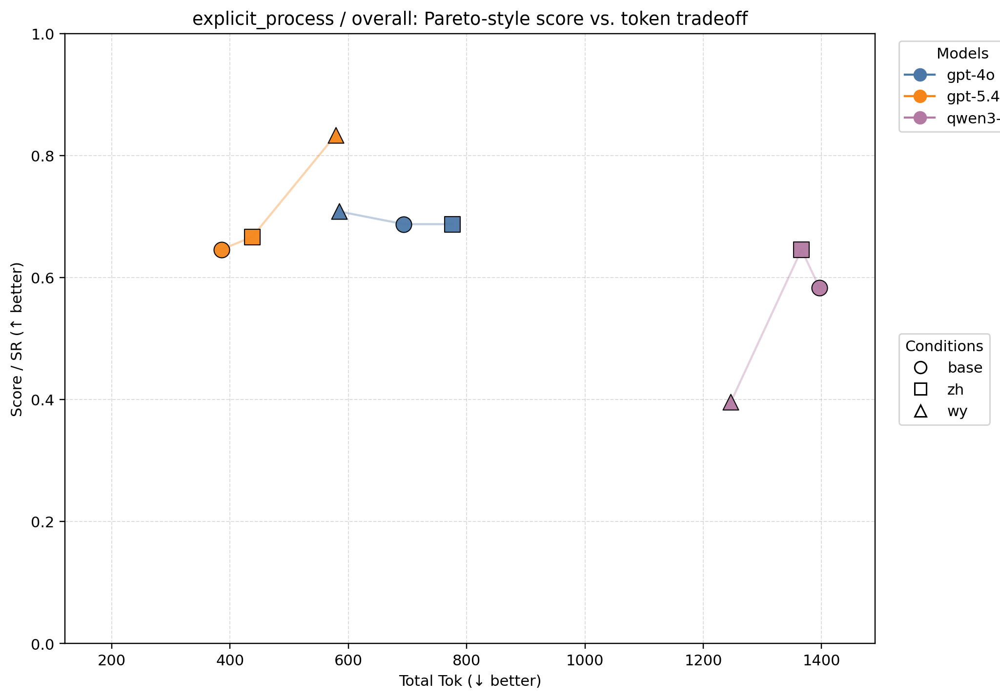

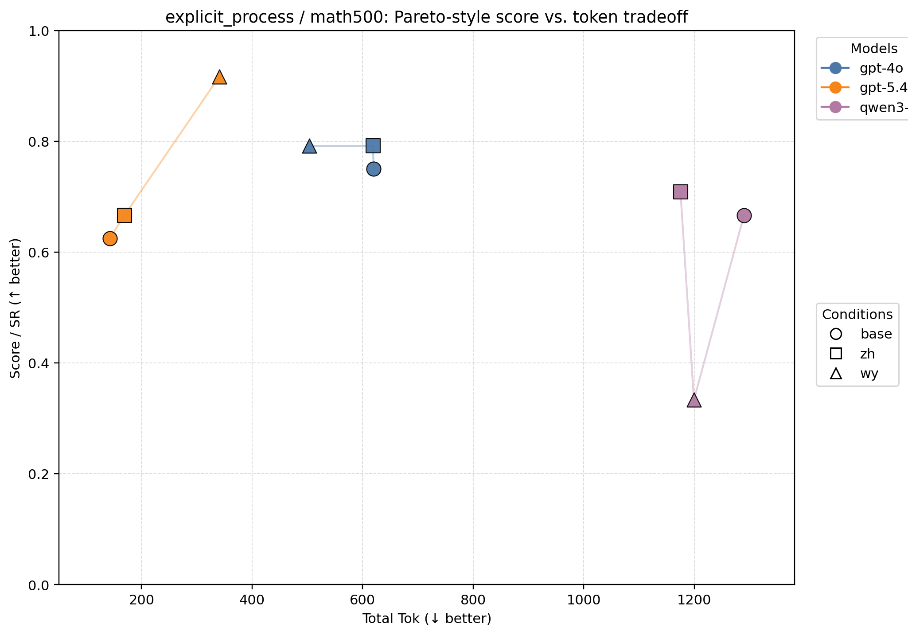
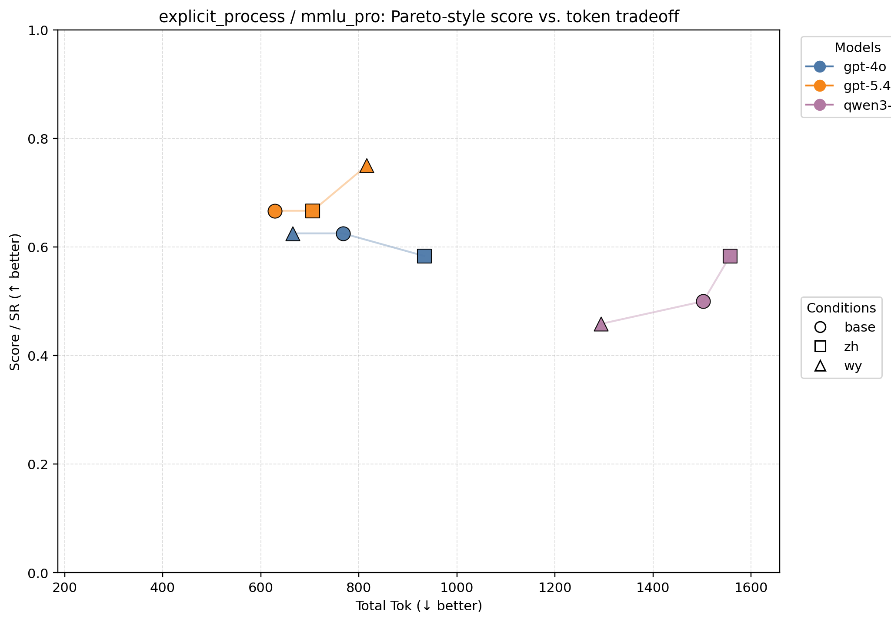

| Metric | Model | Cond | N | SR | Total Tok | Score/1k Tok |
| --- | --- | --- | ---: | ---: | ---: | ---: |
| overall | gpt-4o | base | 48 | 0.688 | 693.88 | 0.991 |
| overall | gpt-4o | zh | 48 | 0.688 | 776.06 | 0.886 |
| overall | gpt-4o | wy | 48 | 0.708 | 584.35 | 1.212 |
| overall | gpt-5.4 | base | 48 | 0.646 | 385.56 | 1.675 |
| overall | gpt-5.4 | zh | 48 | 0.667 | 437.62 | 1.523 |
| overall | gpt-5.4 | wy | 48 | 0.833 | 578.42 | 1.441 |
| overall | qwen3-4b | base | 48 | 0.583 | 1396.25 | 0.418 |
| overall | qwen3-4b | zh | 48 | 0.646 | 1366.08 | 0.473 |
| overall | qwen3-4b | wy | 48 | 0.396 | 1246.54 | 0.318 |
| ifeval | — | — | 0 | — | — | — |
| math500 | gpt-4o | base | 24 | 0.750 | 619.96 | 1.210 |
| math500 | gpt-4o | zh | 24 | 0.792 | 618.71 | 1.280 |
| math500 | gpt-4o | wy | 24 | 0.792 | 503.71 | 1.572 |
| math500 | gpt-5.4 | base | 24 | 0.625 | 142.46 | 4.387 |
| math500 | gpt-5.4 | zh | 24 | 0.667 | 169.25 | 3.939 |
| math500 | gpt-5.4 | wy | 24 | 0.917 | 340.62 | 2.691 |
| math500 | qwen3-4b | base | 24 | 0.667 | 1290.04 | 0.517 |
| math500 | qwen3-4b | zh | 24 | 0.708 | 1175.12 | 0.603 |
| math500 | qwen3-4b | wy | 24 | 0.333 | 1199.42 | 0.278 |
| mmlu_pro | gpt-4o | base | 24 | 0.625 | 767.79 | 0.814 |
| mmlu_pro | gpt-4o | zh | 24 | 0.583 | 933.42 | 0.625 |
| mmlu_pro | gpt-4o | wy | 24 | 0.625 | 665.00 | 0.940 |
| mmlu_pro | gpt-5.4 | base | 24 | 0.667 | 628.67 | 1.060 |
| mmlu_pro | gpt-5.4 | zh | 24 | 0.667 | 706.00 | 0.944 |
| mmlu_pro | gpt-5.4 | wy | 24 | 0.750 | 816.21 | 0.919 |
| mmlu_pro | qwen3-4b | base | 24 | 0.500 | 1502.46 | 0.333 |
| mmlu_pro | qwen3-4b | zh | 24 | 0.583 | 1557.04 | 0.375 |
| mmlu_pro | qwen3-4b | wy | 24 | 0.458 | 1293.67 | 0.354 |

- `explicit_process` 是三组里最支持“强模型 + 文言”结论的一组：`gpt-5.4 / wy` 不仅 overall 最高（`0.833`），在 `math500`（`0.917`）和 `mmlu_pro`（`0.750`）上也都是该组最高分点。
- 对 `gpt-4o` 而言，`wy` 没有带来压倒性分数提升，但它把 token 从 `zh` 的 `776.06` 压到 `584.35`，于是 overall 更像是一个 Pareto 优势点，而不是单纯“更会答”。
- `qwen3-4b` 在这组里明显不吃文言：`wy` overall 仅 `0.396`，显著落后于 `zh` 的 `0.646`。也就是说，显式过程提示并没有把文言压缩收益稳定迁移到较弱开源模型上。
- `ifeval` 面板为空白占位，原因不是模型失败，而是当前导出日志缺少该 benchmark。

## hidden

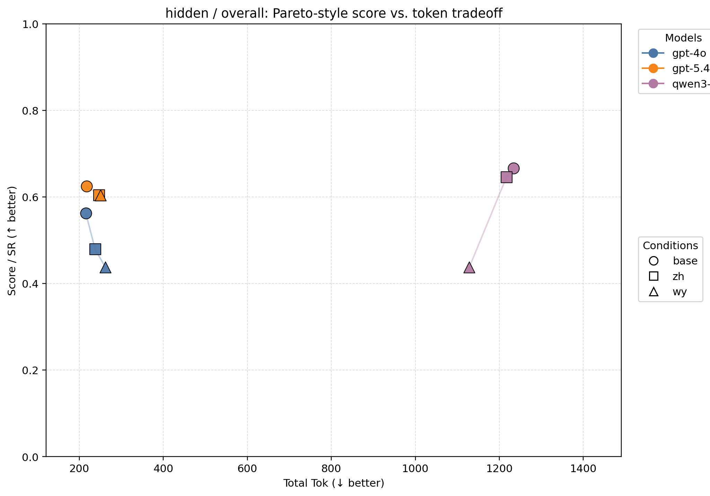
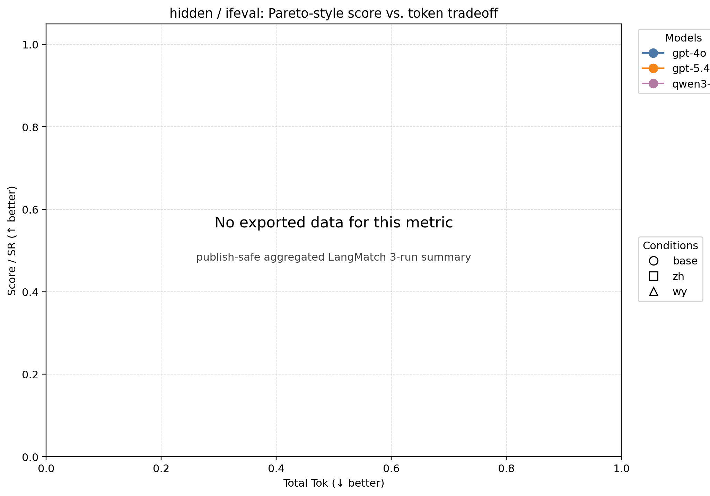
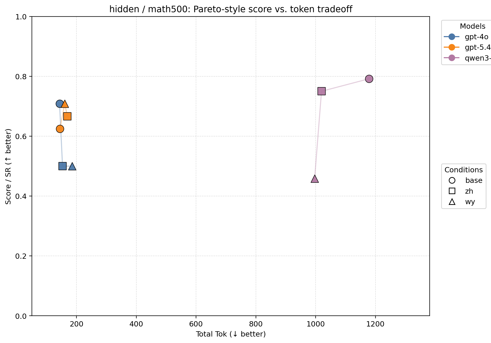
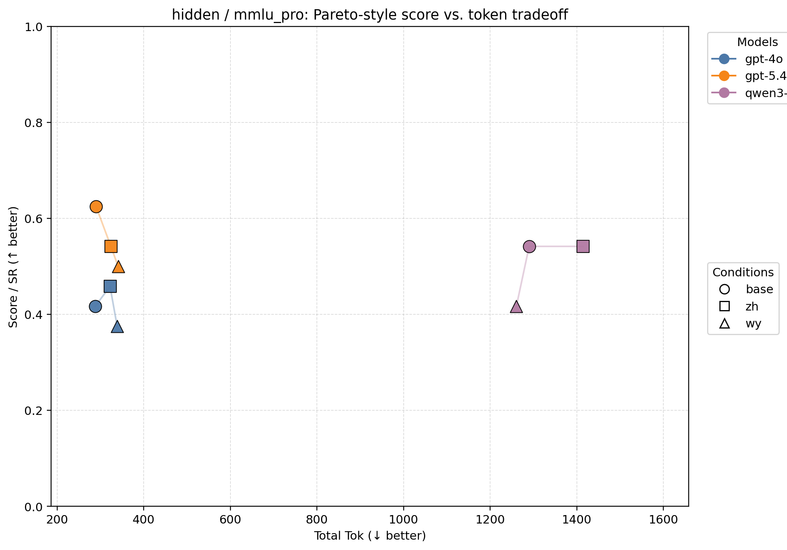

| Metric | Model | Cond | N | SR | Total Tok | Score/1k Tok |
| --- | --- | --- | ---: | ---: | ---: | ---: |
| overall | gpt-4o | base | 48 | 0.562 | 215.54 | 2.610 |
| overall | gpt-4o | zh | 48 | 0.479 | 237.73 | 2.016 |
| overall | gpt-4o | wy | 48 | 0.438 | 262.21 | 1.669 |
| overall | gpt-5.4 | base | 48 | 0.625 | 217.19 | 2.878 |
| overall | gpt-5.4 | zh | 48 | 0.604 | 246.90 | 2.447 |
| overall | gpt-5.4 | wy | 48 | 0.604 | 250.67 | 2.410 |
| overall | qwen3-4b | base | 48 | 0.667 | 1234.19 | 0.540 |
| overall | qwen3-4b | zh | 48 | 0.646 | 1217.04 | 0.531 |
| overall | qwen3-4b | wy | 48 | 0.438 | 1128.46 | 0.388 |
| ifeval | — | — | 0 | — | — | — |
| math500 | gpt-4o | base | 24 | 0.708 | 143.25 | 4.945 |
| math500 | gpt-4o | zh | 24 | 0.500 | 153.12 | 3.265 |
| math500 | gpt-4o | wy | 24 | 0.500 | 185.62 | 2.694 |
| math500 | gpt-5.4 | base | 24 | 0.625 | 144.50 | 4.325 |
| math500 | gpt-5.4 | zh | 24 | 0.667 | 169.46 | 3.934 |
| math500 | gpt-5.4 | wy | 24 | 0.708 | 160.33 | 4.418 |
| math500 | qwen3-4b | base | 24 | 0.792 | 1178.46 | 0.672 |
| math500 | qwen3-4b | zh | 24 | 0.750 | 1019.67 | 0.736 |
| math500 | qwen3-4b | wy | 24 | 0.458 | 996.58 | 0.460 |
| mmlu_pro | gpt-4o | base | 24 | 0.417 | 287.83 | 1.448 |
| mmlu_pro | gpt-4o | zh | 24 | 0.458 | 322.33 | 1.422 |
| mmlu_pro | gpt-4o | wy | 24 | 0.375 | 338.79 | 1.107 |
| mmlu_pro | gpt-5.4 | base | 24 | 0.625 | 289.88 | 2.156 |
| mmlu_pro | gpt-5.4 | zh | 24 | 0.542 | 324.33 | 1.670 |
| mmlu_pro | gpt-5.4 | wy | 24 | 0.500 | 341.00 | 1.466 |
| mmlu_pro | qwen3-4b | base | 24 | 0.542 | 1289.92 | 0.420 |
| mmlu_pro | qwen3-4b | zh | 24 | 0.542 | 1414.42 | 0.383 |
| mmlu_pro | qwen3-4b | wy | 24 | 0.417 | 1260.33 | 0.331 |

- `hidden` 最鲜明的结构不是“谁分最高”，而是**闭源模型 token 急剧下降**：`gpt-4o / base` overall 仅 `215.54 tok`，`gpt-5.4 / base` 也只有 `217.19 tok`。这说明隐藏过程几乎直接切掉了大段可见 reasoning 成本。
- 但 hidden 同时削弱了文言优势：`gpt-5.4` 的 overall 最优回到 `base=0.625`，`wy` 与 `zh` 都没有形成加分；`gpt-4o` 甚至呈现 `base > zh > wy` 的单调下降。
- `qwen3-4b / base` 拿到该组 overall 最高 `0.667`，可它对应 `1234.19 tok`，成本远高于闭源模型。这更像“高成本换稳定性”，而不是更优 Pareto 点。
- 因而，若正文要强调 hidden，重点应是“压成本”，而不是“改写语言条件排序”。

## compact_visible

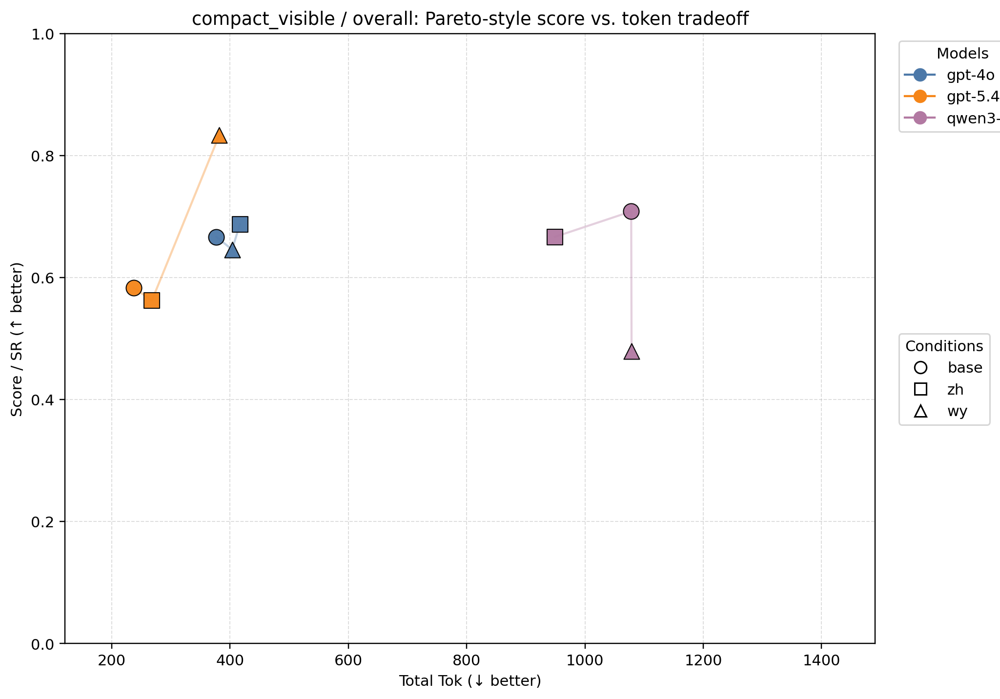
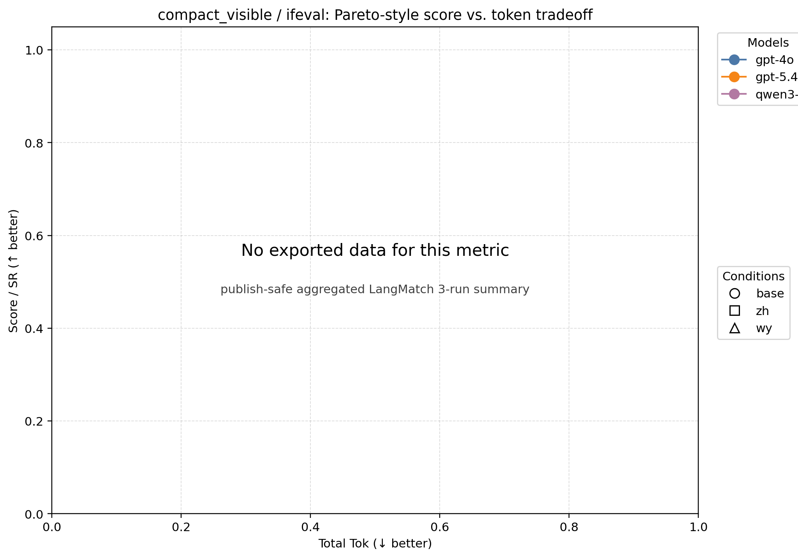
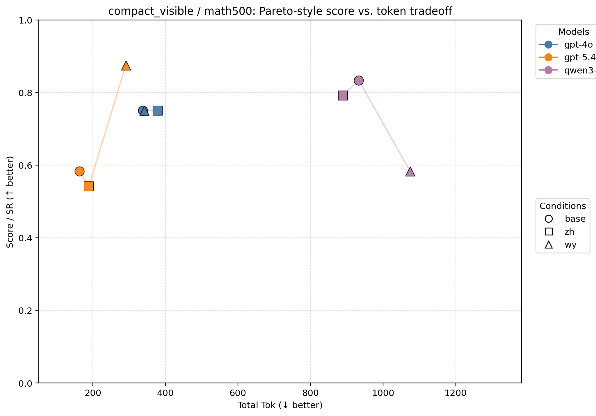
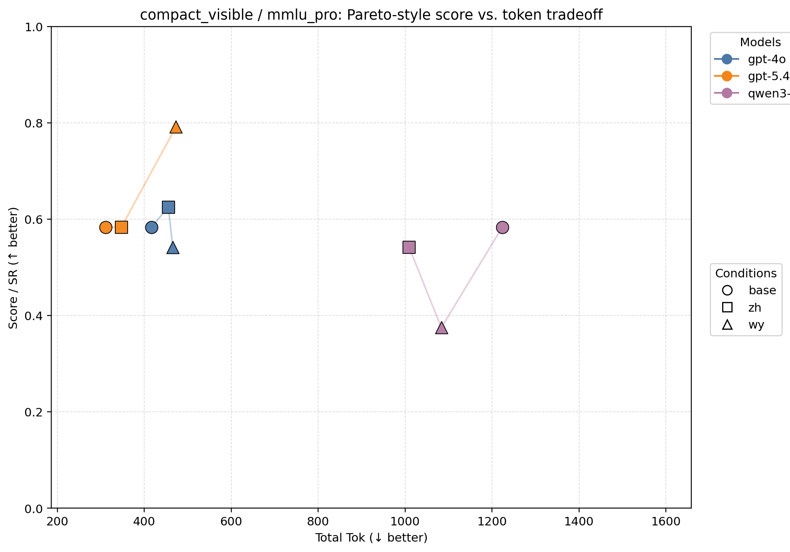

| Metric | Model | Cond | N | SR | Total Tok | Score/1k Tok |
| --- | --- | --- | ---: | ---: | ---: | ---: |
| overall | gpt-4o | base | 48 | 0.667 | 376.94 | 1.769 |
| overall | gpt-4o | zh | 48 | 0.688 | 416.77 | 1.650 |
| overall | gpt-4o | wy | 48 | 0.646 | 403.58 | 1.600 |
| overall | gpt-5.4 | base | 48 | 0.583 | 237.02 | 2.461 |
| overall | gpt-5.4 | zh | 48 | 0.562 | 268.02 | 2.099 |
| overall | gpt-5.4 | wy | 48 | 0.833 | 381.92 | 2.182 |
| overall | qwen3-4b | base | 48 | 0.708 | 1078.15 | 0.657 |
| overall | qwen3-4b | zh | 48 | 0.667 | 949.25 | 0.702 |
| overall | qwen3-4b | wy | 48 | 0.479 | 1078.79 | 0.444 |
| ifeval | — | — | 0 | — | — | — |
| math500 | gpt-4o | base | 24 | 0.750 | 337.38 | 2.223 |
| math500 | gpt-4o | zh | 24 | 0.750 | 378.12 | 1.983 |
| math500 | gpt-4o | wy | 24 | 0.750 | 341.50 | 2.196 |
| math500 | gpt-5.4 | base | 24 | 0.583 | 162.50 | 3.590 |
| math500 | gpt-5.4 | zh | 24 | 0.542 | 188.71 | 2.870 |
| math500 | gpt-5.4 | wy | 24 | 0.875 | 290.83 | 3.009 |
| math500 | qwen3-4b | base | 24 | 0.833 | 932.79 | 0.893 |
| math500 | qwen3-4b | zh | 24 | 0.792 | 889.21 | 0.890 |
| math500 | qwen3-4b | wy | 24 | 0.583 | 1074.38 | 0.543 |
| mmlu_pro | gpt-4o | base | 24 | 0.583 | 416.50 | 1.401 |
| mmlu_pro | gpt-4o | zh | 24 | 0.625 | 455.42 | 1.372 |
| mmlu_pro | gpt-4o | wy | 24 | 0.542 | 465.67 | 1.163 |
| mmlu_pro | gpt-5.4 | base | 24 | 0.583 | 311.54 | 1.872 |
| mmlu_pro | gpt-5.4 | zh | 24 | 0.583 | 347.33 | 1.679 |
| mmlu_pro | gpt-5.4 | wy | 24 | 0.792 | 473.00 | 1.674 |
| mmlu_pro | qwen3-4b | base | 24 | 0.583 | 1223.50 | 0.477 |
| mmlu_pro | qwen3-4b | zh | 24 | 0.542 | 1009.29 | 0.537 |
| mmlu_pro | qwen3-4b | wy | 24 | 0.375 | 1083.21 | 0.346 |

- `compact_visible` 给出了本批结果里最像“可写进正文主图”的结构：`gpt-5.4 / wy` overall 仍是 `0.833`，但总 token 从 explicit 的 `578.42` 降到 `381.92`，说明保留紧凑可见输出时，文言优势并未消失，反而更省。
- `gpt-5.4 / base` 则是该组最低成本点（`237.02 tok`）且 `Score/1k Tok=2.461` 最高，意味着同一模型内部已经形成很清楚的质量—成本前沿：`base` 管效率，`wy` 管绝对分数。
- `gpt-4o` 在这组更偏好 `zh`：overall 最高是 `0.688`，但 `base` 的 token 更低，因此二者形成较典型的轻度 Pareto 分工；`wy` 没有在闭源次强模型上复制 `gpt-5.4` 的收益。
- `qwen3-4b` 仍不支持“文言普适增益”：overall 里 `base` 分数最高（`0.708`），`zh` 成本略低且效率略高，`wy` 继续落后。

## 跨实验组总结

### 1. 文言增益是条件性的，不是通用规律

从三组 overall 看，`wy` 真正稳定受益的是 `gpt-5.4`，而且主要出现在 `explicit_process` 与 `compact_visible`。一旦切到 `hidden`，文言优势就基本消失；切到 `qwen3-4b`，文言则三组都不占优。因此更准确的表述不是“文言 prompt 更强”，而是：**文言是一种对强模型、且对可见推理形式有依赖的条件性压缩策略。**

### 2. hidden 的研究价值在“压成本”，不在“提分”

`hidden` 组把闭源模型 overall token 压到约 `215–251`，远低于另外两组。这说明隐藏过程非常有效地降低了可见生成开销。但它没有带来最强分数点，反而削弱了不同语言条件之间的差异。因此它更像部署侧的成本控制手段，而不是语言比较的最佳主战场。

### 3. compact_visible 可能是最适合正文主展示的折中方案

`compact_visible` 同时保留了条件差异、可见输出与较低 token：`gpt-5.4 / wy` 维持最高 overall，`gpt-5.4 / base` 维持最高效率，而 `gpt-4o`、`qwen3-4b` 的条件排序也仍清晰。这使它比 `explicit_process` 更节省、比 `hidden` 更有解释力。

### 4. qwen3-4b 的主结论是“文言不稳”，不是“模型全面落后”

`qwen3-4b` 在 `hidden` 与 `compact_visible / math500` 上能给出不错的分数，但这些点通常需要显著更高 token。它的问题不只是准确率，也包括成本曲线太陡。更重要的是，它没有稳定吸收文言压缩带来的收益，因此不能把闭源强模型上的 `wy` 现象直接外推到较弱开源模型。

## 建议写进正文的结论

> 在 LangMatch 3-run 的当前导出结果中，文言文并未表现为跨模型、跨实验组的通用最优提示语言；它的收益主要集中在 `gpt-5.4` 这类强模型，并且依赖于 `explicit_process` 或 `compact_visible` 这类仍保留一定推理可见性的提示设置。相反，`hidden` 的主要作用是显著降低 token 成本，而不是放大语言条件差异。对 `qwen3-4b` 而言，更稳妥的选择仍是 `base` 或 `zh`，这说明“文言作为自然语言 prompt compression”更像一种条件性策略，而非可无条件迁移的普适技巧。
