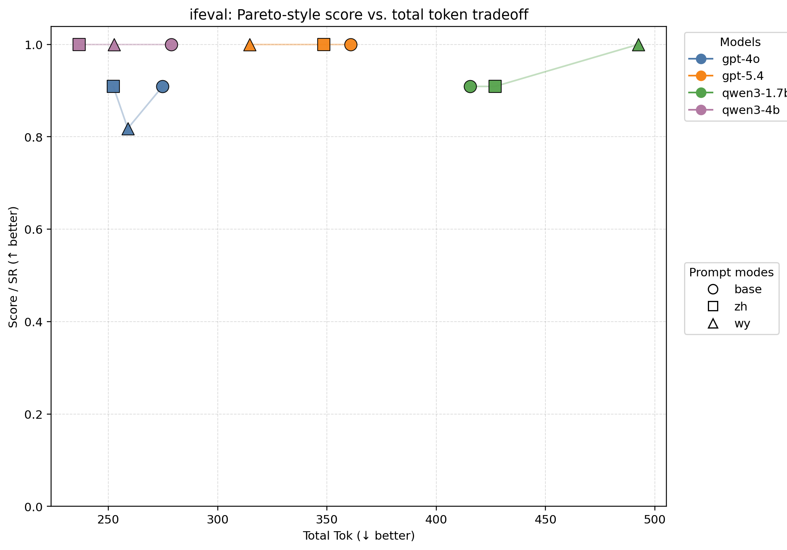
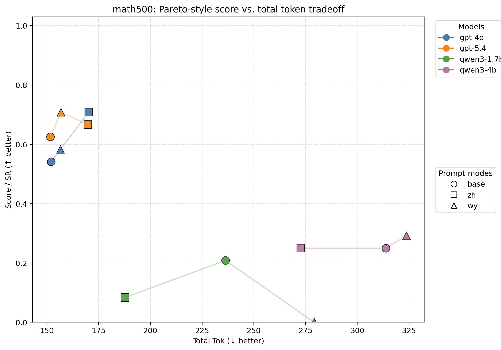
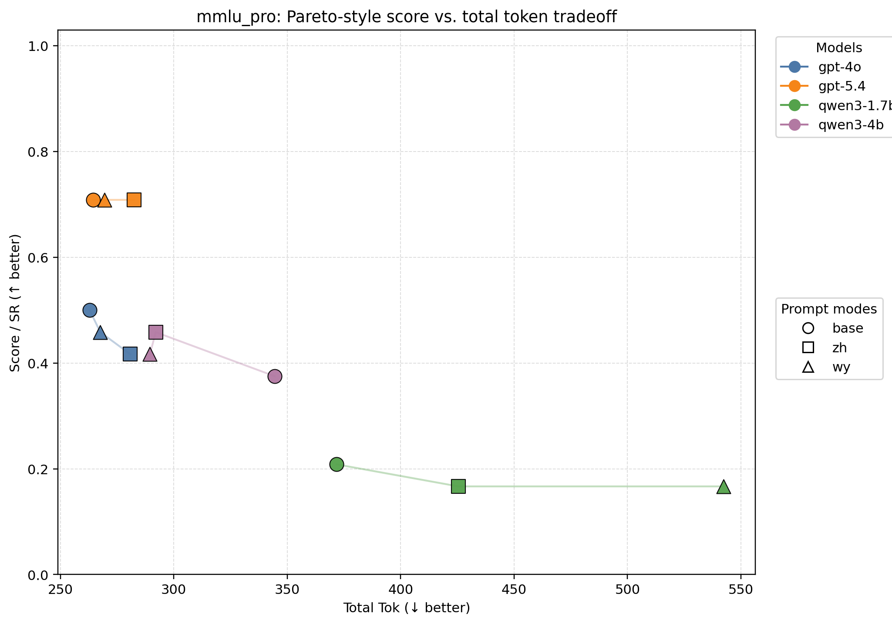

# Matrix Evaluation Summary

> **2048 rerun status note**
>
> This report is the corrected rerun version using a standardized output budget of `2048` for all benchmarks. The rerun removes the major truncation artifact that affected the original pilot, especially `gpt-5.4 / IFEval`.
>
> Post-rerun truncation audit:
>
> - `gpt-4o`: `0` cap-hits, `0` empty outputs
> - `gpt-5.4`: `0` cap-hits, `0` empty outputs
> - `qwen3-4b`: `0` cap-hits, `0` empty outputs
> - `qwen3-1.7b`: `4` cap-hits remain (`finish_reason=length`), so this model still carries a small residual truncation risk under `2048`
>
> Therefore, this rerun is suitable as the **corrected main matrix** for the closed-source models and `qwen3-4b`, while `qwen3-1.7b` should still be interpreted with mild caution.

This report compares closed-source and open-source models under three prompt modes: `base`, `zh_compact`, and `wy`. Metrics are reported both as task success / score and as token usage (`Prompt Tok`, `Completion Tok`, `Total Tok`) so that quality-cost tradeoffs remain visible rather than being collapsed into a single ranking.

The figures below present Pareto-style scatter plots of **Score vs. Total Tokens**, with **colors for models** and **marker shapes for prompt variants**, so that within-model base/zh/wy tradeoffs remain visible in a paper-friendly format.

## Overall by Model and Prompt

### Overall analysis

- The rerun materially changes the earlier interpretation: `gpt-5.4` is now the strongest model overall, and its previous weak `IFEval` showing was confirmed to be a truncation artifact rather than a real instruction-following deficit.
- `zh_compact` remains the most stable prompt family across model types: it is best for `gpt-4o`, ties best for `qwen3-4b`, and stays competitive on every benchmark.
- `wy` remains a conditional gain. It is best overall for `gpt-5.4`, and still looks strongest on `gpt-5.4 / MATH-500`, but it does not dominate weaker open models.
- `qwen3-1.7b` improves under `2048`, but still exhibits residual truncation. Its current numbers are more trustworthy than before, though still not as clean as the other three model tracks.

| Model | Prompt | N | Score | Prompt Tok | Completion Tok | Total Tok | Score/1k Tok |
| --- | --- | ---: | ---: | ---: | ---: | ---: | ---: |
| gpt-4o | base | 59 | 0.593 | 182.93 | 37.12 | 220.05 | 2.696 |
| gpt-4o | zh_compact | 59 | 0.627 | 200.93 | 29.59 | 230.53 | 2.720 |
| gpt-4o | wy | 59 | 0.576 | 187.93 | 32.86 | 220.80 | 2.610 |
| gpt-5.4 | base | 59 | 0.729 | 181.93 | 54.64 | 236.58 | 3.081 |
| gpt-5.4 | zh_compact | 59 | 0.746 | 199.93 | 49.05 | 248.98 | 2.995 |
| gpt-5.4 | wy | 59 | 0.763 | 186.93 | 45.15 | 232.08 | 3.286 |
| qwen3-1.7b | base | 59 | 0.339 | 197.85 | 127.00 | 324.85 | 1.044 |
| qwen3-1.7b | zh_compact | 59 | 0.271 | 203.85 | 125.20 | 329.05 | 0.824 |
| qwen3-1.7b | wy | 59 | 0.254 | 197.85 | 228.12 | 425.97 | 0.597 |
| qwen3-4b | base | 59 | 0.441 | 197.85 | 121.95 | 319.80 | 1.378 |
| qwen3-4b | zh_compact | 59 | 0.475 | 203.85 | 69.98 | 273.83 | 1.733 |
| qwen3-4b | wy | 59 | 0.475 | 197.85 | 98.71 | 296.56 | 1.600 |

## ifeval

### IFEval analysis

- The most important correction is here: after removing the token-cap artifact, `gpt-5.4` reaches `1.000` SR under all three prompt modes.
- This means the earlier apparent gap where `gpt-5.4` sat below `gpt-4o` on `IFEval` was not a plotting bug and not a genuine model weakness; it was an output-budget artifact.
- On this benchmark, `zh_compact` remains a strong and efficient control language, but the corrected rerun shows that high-capacity models can satisfy the benchmark fully under multiple prompt modes.
- `qwen3-4b` also reaches `1.000` across all modes, while `qwen3-1.7b` becomes much stronger than in the original pilot, though it still spends substantially more completion budget.

| Model | Prompt | N | Score | Prompt Tok | Completion Tok | Total Tok | Score/1k Tok |
| --- | --- | ---: | ---: | ---: | ---: | ---: | ---: |
| gpt-4o | base | 11 | 0.909 | 92.45 | 182.36 | 274.82 | 3.308 |
| gpt-4o | zh_compact | 11 | 0.909 | 110.45 | 141.82 | 252.27 | 3.604 |
| gpt-4o | wy | 11 | 0.818 | 97.45 | 161.45 | 258.91 | 3.160 |
| gpt-5.4 | base | 11 | 1.000 | 91.45 | 269.36 | 360.82 | 2.771 |
| gpt-5.4 | zh_compact | 11 | 1.000 | 109.45 | 239.09 | 348.55 | 2.869 |
| gpt-5.4 | wy | 11 | 1.000 | 96.45 | 218.18 | 314.64 | 3.178 |
| qwen3-1.7b | base | 11 | 0.909 | 101.00 | 314.55 | 415.55 | 2.188 |
| qwen3-1.7b | zh_compact | 11 | 0.909 | 107.00 | 319.91 | 426.91 | 2.129 |
| qwen3-1.7b | wy | 11 | 1.000 | 101.00 | 391.45 | 492.45 | 2.031 |
| qwen3-4b | base | 11 | 1.000 | 101.00 | 177.82 | 278.82 | 3.587 |
| qwen3-4b | zh_compact | 11 | 1.000 | 107.00 | 129.64 | 236.64 | 4.226 |
| qwen3-4b | wy | 11 | 1.000 | 101.00 | 151.73 | 252.73 | 3.957 |

## math500

### MATH-500 analysis

- The corrected rerun preserves the earlier qualitative pattern on the strong closed models: `zh_compact` is best for `gpt-4o`, while `wy` is best for `gpt-5.4`.
- This strengthens the original research intuition: Wenyan is not universally best, but on sufficiently capable models and on concise reasoning tasks it can become a real quality-cost contender rather than a stylistic novelty.
- `qwen3-4b` now shows its best score under `wy`, while `zh_compact` remains slightly cheaper in total tokens. This is exactly the kind of Pareto tradeoff the project is trying to characterize.
- `qwen3-1.7b` still performs poorly here, suggesting that the bottleneck is no longer just truncation; the model likely lacks enough mathematical reasoning capacity for this setting.

| Model | Prompt | N | Score | Prompt Tok | Completion Tok | Total Tok | Score/1k Tok |
| --- | --- | ---: | ---: | ---: | ---: | ---: | ---: |
| gpt-4o | base | 24 | 0.542 | 146.79 | 5.29 | 152.08 | 3.562 |
| gpt-4o | zh_compact | 24 | 0.708 | 164.79 | 5.46 | 170.25 | 4.161 |
| gpt-4o | wy | 24 | 0.583 | 151.79 | 4.71 | 156.50 | 3.727 |
| gpt-5.4 | base | 24 | 0.625 | 145.79 | 5.88 | 151.67 | 4.121 |
| gpt-5.4 | zh_compact | 24 | 0.667 | 163.79 | 6.00 | 169.79 | 3.926 |
| gpt-5.4 | wy | 24 | 0.708 | 150.79 | 6.00 | 156.79 | 4.518 |
| qwen3-1.7b | base | 24 | 0.208 | 158.21 | 78.12 | 236.33 | 0.882 |
| qwen3-1.7b | zh_compact | 24 | 0.083 | 164.21 | 23.54 | 187.75 | 0.444 |
| qwen3-1.7b | wy | 24 | 0.000 | 158.21 | 120.92 | 279.12 | 0.000 |
| qwen3-4b | base | 24 | 0.250 | 158.21 | 155.62 | 313.83 | 0.797 |
| qwen3-4b | zh_compact | 24 | 0.250 | 164.21 | 108.46 | 272.67 | 0.917 |
| qwen3-4b | wy | 24 | 0.292 | 158.21 | 165.50 | 323.71 | 0.901 |

## mmlu_pro

### MMLU-Pro analysis

- `MMLU-Pro` remains the most conservative benchmark in the matrix. It does not reward Wenyan as clearly as `MATH-500` does.
- `gpt-5.4` is now uniformly strong across all three prompt modes, indicating that once truncation is removed, this benchmark becomes relatively insensitive to prompt-language variation for the strongest closed model.
- `gpt-4o` still prefers `base`, while `qwen3-4b` still prefers `zh_compact`. That pattern survived the rerun, which makes it much more believable as a real model-task interaction rather than a cap artifact.
- `qwen3-1.7b` improves somewhat, but it remains clearly weaker and much more verbose than the stronger systems.

## Corrected cross-benchmark takeaways

- After the 2048 rerun, the main empirical claim is stronger: **prompt-language effects are real, but highly model-dependent and task-dependent**.
- `zh_compact` is still the most robust default overall, especially if the goal is to stay strong across both closed and open families.
- `wy` should now be treated as a serious candidate condition for strong models rather than a novelty baseline, because its gains on `gpt-5.4` survive the corrected rerun.
- The remaining weak point in the corrected matrix is `qwen3-1.7b`, which still shows 4 cap-hits; if publication-grade fairness is required for that model too, it should be rerun once more with a budget above `2048`.

| Model | Prompt | N | Score | Prompt Tok | Completion Tok | Total Tok | Score/1k Tok |
| --- | --- | ---: | ---: | ---: | ---: | ---: | ---: |
| gpt-4o | base | 24 | 0.500 | 260.54 | 2.38 | 262.92 | 1.902 |
| gpt-4o | zh_compact | 24 | 0.417 | 278.54 | 2.29 | 280.83 | 1.484 |
| gpt-4o | wy | 24 | 0.458 | 265.54 | 2.08 | 267.62 | 1.713 |
| gpt-5.4 | base | 24 | 0.708 | 259.54 | 5.00 | 264.54 | 2.678 |
| gpt-5.4 | zh_compact | 24 | 0.708 | 277.54 | 5.00 | 282.54 | 2.507 |
| gpt-5.4 | wy | 24 | 0.708 | 264.54 | 5.00 | 269.54 | 2.628 |
| qwen3-1.7b | base | 24 | 0.208 | 281.88 | 89.92 | 371.79 | 0.560 |
| qwen3-1.7b | zh_compact | 24 | 0.167 | 287.88 | 137.62 | 425.50 | 0.392 |
| qwen3-1.7b | wy | 24 | 0.167 | 281.88 | 260.46 | 542.33 | 0.307 |
| qwen3-4b | base | 24 | 0.375 | 281.88 | 62.67 | 344.54 | 1.088 |
| qwen3-4b | zh_compact | 24 | 0.458 | 287.88 | 4.17 | 292.04 | 1.569 |
| qwen3-4b | wy | 24 | 0.417 | 281.88 | 7.62 | 289.50 | 1.439 |
