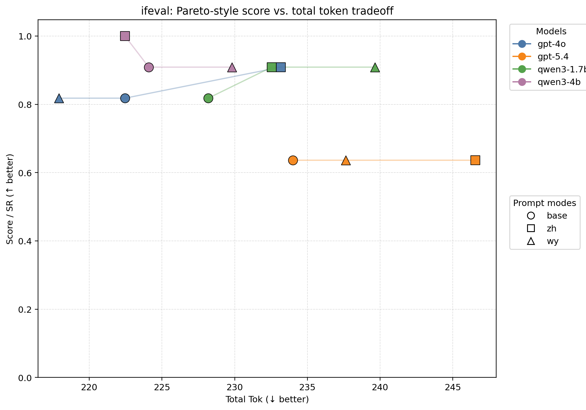
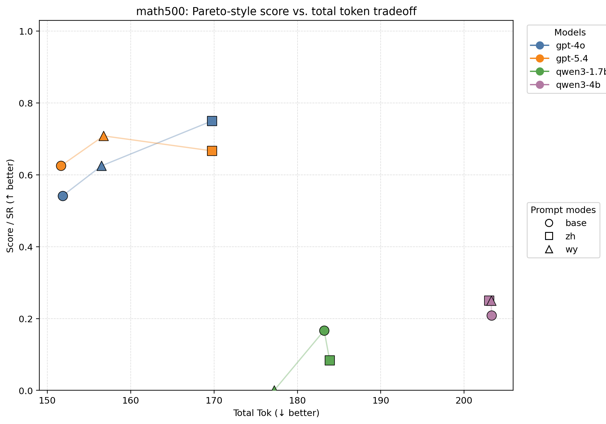
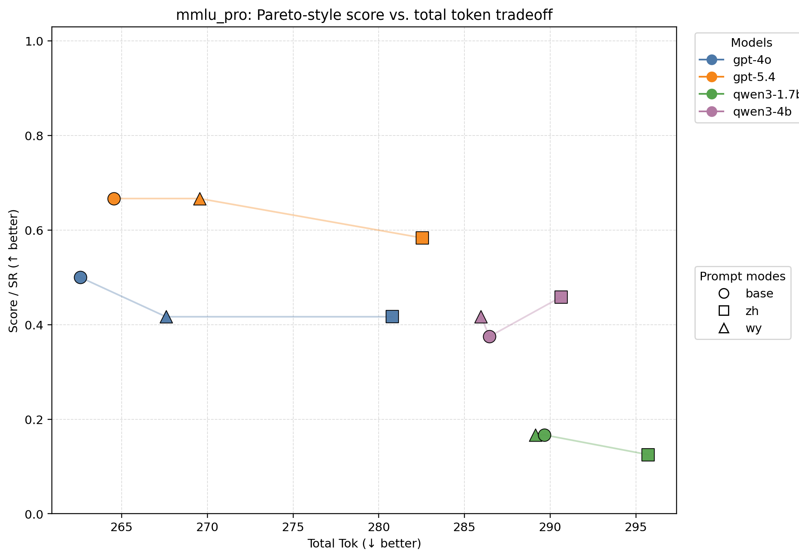

# 矩阵评测结果（中文分析版）

> **重要方法学说明**
>
> 当前这份矩阵结果应被视为 **truncated pilot（被输出上限截断的探索性结果）**，而不是最终版公平比较。后续审计发现，原矩阵使用的 benchmark 级输出上限过紧：`IFEval=192`、`MATH-500=64`、`MMLU-Pro=8`，这会把“模型能力”与“输出预算压力”混在一起。
>
> 已确认的异常包括：
>
> - `gpt-5.4 / IFEval`：`17/33` 条结果出现“可见输出为空，但 completion budget 被吃满”的情况；把同一 slice 改为 `max_completion_tokens=2048` 后，变成 `0` 空响应、`1.000` SR。
> - `gpt-4o`：`IFEval` 上有 `12/33` cap-hit。
> - `qwen3-1.7b`：`IFEval 15/33`、`MMLU-Pro 63/72`、`MATH-500 10/72` 出现 cap-hit。
> - `qwen3-4b`：`IFEval 14/33`、`MMLU-Pro 21/72`、`MATH-500 40/72` 出现 cap-hit。
>
> 因此，下文图表和结论仍可作为探索性观察，但**不应被当成最终定稿证据**。更严格的修正方案是：把整套矩阵在更宽松的输出预算（当前建议 `2048`）下统一重跑，再重新汇总报告。

本文档给出现有矩阵评测结果的中文解读。评测同时比较了闭源模型与开源模型、三种提示模式，以及三个不同类型的 benchmark。为了保留质量—成本之间的权衡，本文同时报告任务分数与 token 消耗，而不是只给单一排名。

当前设置如下：

- 模型：`gpt-4o`、`gpt-5.4`、`qwen3-1.7b`、`qwen3-4b`
- prompt 模式：`base`、`zh_compact`、`wy`
- benchmark：`IFEval`、`MATH-500`、`MMLU-Pro`
- 指标：`Score / SR`、`Prompt Tok`、`Completion Tok`、`Total Tok`、`Score/1k Tok`

下方图使用 **Pareto 风格散点图**：

- 横轴：`Total Tok`（越低越好）
- 纵轴：`Score / SR`（越高越好）
- 颜色：模型
- 点形：prompt 模式

这样可以同时看出同一模型内部 `base / zh_compact / wy` 的组内 tradeoff，也能看出模型之间的总体位置差异。

## 总体结果

| Model | Prompt | N | Score | Prompt Tok | Completion Tok | Total Tok | Score/1k Tok |
| --- | --- | ---: | ---: | ---: | ---: | ---: | ---: |
| gpt-4o | base | 59 | 0.576 | 182.93 | 27.12 | 210.05 | 2.743 |
| gpt-4o | zh_compact | 59 | 0.644 | 200.93 | 25.81 | 226.75 | 2.840 |
| gpt-4o | wy | 59 | 0.576 | 187.93 | 25.20 | 213.14 | 2.704 |
| gpt-5.4 | base | 59 | 0.644 | 181.93 | 30.98 | 212.92 | 3.025 |
| gpt-5.4 | zh_compact | 59 | 0.627 | 199.93 | 30.02 | 229.95 | 2.727 |
| gpt-5.4 | wy | 59 | 0.678 | 186.93 | 30.78 | 217.71 | 3.114 |
| qwen3-1.7b | base | 59 | 0.288 | 197.85 | 37.05 | 234.90 | 1.227 |
| qwen3-1.7b | zh_compact | 59 | 0.254 | 203.85 | 34.59 | 238.44 | 1.066 |
| qwen3-1.7b | wy | 59 | 0.237 | 197.85 | 36.53 | 234.37 | 1.012 |
| qwen3-4b | base | 59 | 0.407 | 197.85 | 43.15 | 241.00 | 1.688 |
| qwen3-4b | zh_compact | 59 | 0.475 | 203.85 | 38.42 | 242.27 | 1.959 |
| qwen3-4b | wy | 59 | 0.441 | 197.85 | 44.00 | 241.85 | 1.822 |

### 总体分析

- **不存在一个对所有模型、所有任务都普遍最优的 prompt 语言。** 这个结论比“文言文一定更省 token”或“现代中文一定更强”更贴近当前证据。
- **`zh_compact` 是当前最稳的默认选项。** 它在 `gpt-4o` 和 `qwen3-4b` 的 overall 上都取得最好分数，说明压缩后的现代中文在多数情况下既保留了可控性，也保留了较强的任务表现。
- **`wy` 不是普遍优势，但也不是无效变量。** 在 `gpt-5.4` 上，`wy` 的 overall 最优，说明文言风格并非只能带来噪声；当模型足够强时，它确实可能成为有效的压缩/控制语言。
- **小模型更容易被文言风格拖垮。** `qwen3-1.7b` 上 `wy` 和 `zh_compact` 都没有超过 `base`，说明对较弱模型来说，额外的风格压缩和表达迁移会增加理解负担。
- 从 token 看，`wy` 往往比 `zh_compact` 更省，但省出来的 token 并不总能换来更高分。因此这更像一个**质量—成本 tradeoff 问题**，而不是单纯的“谁更短”。

## IFEval

| Model | Prompt | N | Score | Prompt Tok | Completion Tok | Total Tok | Score/1k Tok |
| --- | --- | ---: | ---: | ---: | ---: | ---: | ---: |
| gpt-4o | base | 11 | 0.818 | 92.45 | 130.00 | 222.45 | 3.678 |
| gpt-4o | zh_compact | 11 | 0.909 | 110.45 | 122.73 | 233.18 | 3.899 |
| gpt-4o | wy | 11 | 0.818 | 97.45 | 120.45 | 217.91 | 3.755 |
| gpt-5.4 | base | 11 | 0.636 | 91.45 | 142.55 | 234.00 | 2.720 |
| gpt-5.4 | zh_compact | 11 | 0.636 | 109.45 | 137.09 | 246.55 | 2.581 |
| gpt-5.4 | wy | 11 | 0.636 | 96.45 | 141.18 | 237.64 | 2.678 |
| qwen3-1.7b | base | 11 | 0.818 | 101.00 | 127.18 | 228.18 | 3.586 |
| qwen3-1.7b | zh_compact | 11 | 0.909 | 107.00 | 125.55 | 232.55 | 3.909 |
| qwen3-1.7b | wy | 11 | 0.909 | 101.00 | 138.64 | 239.64 | 3.794 |
| qwen3-4b | base | 11 | 0.909 | 101.00 | 123.09 | 224.09 | 4.057 |
| qwen3-4b | zh_compact | 11 | 1.000 | 107.00 | 115.45 | 222.45 | 4.495 |
| qwen3-4b | wy | 11 | 0.909 | 101.00 | 128.82 | 229.82 | 3.956 |

### 中文解读

- `IFEval` 主要测的是**指令遵循与格式控制**，因此它更能体现 prompt 语言是不是在帮助模型“按要求做事”。
- 这一项上，**`zh_compact` 最稳**。在 `gpt-4o` 上它最好，在 `qwen3-4b` 上更是达到 `1.000`，说明现代中文压缩提示在显式约束场景下最可控。
- `wy` 在开源模型上并非完全失效，尤其 `qwen3-1.7b` 上与 `zh_compact` 打平；但在闭源模型上它没有明显优于 `zh_compact`。
- 从 Pareto 图看，`wy` 有时能少花一点 token，但这类节省没有稳定转化成更高 SR，因此在**强约束任务**里，现代中文压缩版仍然更安全。

## MATH-500

| Model | Prompt | N | Score | Prompt Tok | Completion Tok | Total Tok | Score/1k Tok |
| --- | --- | ---: | ---: | ---: | ---: | ---: | ---: |
| gpt-4o | base | 24 | 0.542 | 146.79 | 5.04 | 151.83 | 3.568 |
| gpt-4o | zh_compact | 24 | 0.750 | 164.79 | 4.96 | 169.75 | 4.418 |
| gpt-4o | wy | 24 | 0.625 | 151.79 | 4.71 | 156.50 | 3.994 |
| gpt-5.4 | base | 24 | 0.625 | 145.79 | 5.83 | 151.62 | 4.122 |
| gpt-5.4 | zh_compact | 24 | 0.667 | 163.79 | 5.96 | 169.75 | 3.927 |
| gpt-5.4 | wy | 24 | 0.708 | 150.79 | 5.96 | 156.75 | 4.519 |
| qwen3-1.7b | base | 24 | 0.167 | 158.21 | 25.00 | 183.21 | 0.910 |
| qwen3-1.7b | zh_compact | 24 | 0.083 | 164.21 | 19.67 | 183.88 | 0.453 |
| qwen3-1.7b | wy | 24 | 0.000 | 158.21 | 19.00 | 177.21 | 0.000 |
| qwen3-4b | base | 24 | 0.208 | 158.21 | 45.08 | 203.29 | 1.025 |
| qwen3-4b | zh_compact | 24 | 0.250 | 164.21 | 38.79 | 203.00 | 1.232 |
| qwen3-4b | wy | 24 | 0.250 | 158.21 | 45.04 | 203.25 | 1.230 |

### 中文解读

- `MATH-500` 是当前矩阵里最能体现**解题能力与压缩收益是否真正兼容**的 benchmark。
- 在强闭源模型上，压缩中文变体确实有收益，但**收益形式不是一致的**：
  - `gpt-4o` 最好的是 `zh_compact`
  - `gpt-5.4` 最好的是 `wy`
- 这说明当模型能力足够强时，文言文不只是“看起来更短”，它有可能在某些推理任务中形成真正有效的控制语言。
- 但这个结论**不具备普适性**。在 `qwen3-1.7b` 上，`wy = 0.000`，几乎可以视为崩掉；这表明文言风格对弱模型的理解负担过高。
- `qwen3-4b` 有一定恢复，但幅度仍有限，说明文言收益是**能力门槛依赖的**：模型越强，越有可能把文言的凝练性转化成推理收益；模型越弱，越可能只感受到额外歧义。

## MMLU-Pro

| Model | Prompt | N | Score | Prompt Tok | Completion Tok | Total Tok | Score/1k Tok |
| --- | --- | ---: | ---: | ---: | ---: | ---: | ---: |
| gpt-4o | base | 24 | 0.500 | 260.54 | 2.04 | 262.58 | 1.904 |
| gpt-4o | zh_compact | 24 | 0.417 | 278.54 | 2.25 | 280.79 | 1.484 |
| gpt-4o | wy | 24 | 0.417 | 265.54 | 2.04 | 267.58 | 1.557 |
| gpt-5.4 | base | 24 | 0.667 | 259.54 | 5.00 | 264.54 | 2.520 |
| gpt-5.4 | zh_compact | 24 | 0.583 | 277.54 | 5.00 | 282.54 | 2.065 |
| gpt-5.4 | wy | 24 | 0.667 | 264.54 | 5.00 | 269.54 | 2.473 |
| qwen3-1.7b | base | 24 | 0.167 | 281.88 | 7.79 | 289.67 | 0.575 |
| qwen3-1.7b | zh_compact | 24 | 0.125 | 287.88 | 7.83 | 295.71 | 0.423 |
| qwen3-1.7b | wy | 24 | 0.167 | 281.88 | 7.25 | 289.12 | 0.576 |
| qwen3-4b | base | 24 | 0.375 | 281.88 | 4.58 | 286.46 | 1.309 |
| qwen3-4b | zh_compact | 24 | 0.458 | 287.88 | 2.75 | 290.62 | 1.577 |
| qwen3-4b | wy | 24 | 0.417 | 281.88 | 4.08 | 285.96 | 1.457 |

### 中文解读

- `MMLU-Pro` 比 `MATH-500` 更保守，它更像是在测**一般知识 + 跨领域多选推理**，不太奖励激进的风格重写。
- 在这个 benchmark 上，`base` 和 `zh_compact` 通常更稳。`gpt-4o` 上两种压缩条件都输给了 `base`，说明有些知识型推理任务对 prompt 风格变化更敏感。
- `gpt-5.4` 上 `wy` 可以和 `base` 打平，但并没有形成明显的 token 优势，因此这里的文言收益不如 `MATH-500` 清晰。
- 对开源模型来说，`qwen3-4b` 上 `zh_compact` 最优，而 `qwen3-1.7b` 上仍然没有看到文言的增益。这进一步说明：**文言更像一个条件性增益变量，而不是普适模板。**

## 跨 benchmark 总结

### 1. `zh_compact` 是当前最稳的默认方案

如果目标是“在多数模型和多数任务上尽量不踩坑”，那么 `zh_compact` 目前是最稳的默认值。它在 `gpt-4o`、`qwen3-4b` 上都有明显优势，而且在 `IFEval` 这种强约束场景里尤其可靠。

### 2. `wy` 的价值是条件性的，而不是普遍性的

文言不是完全无效，也不是普遍最优。它在 `gpt-5.4` 尤其是 `MATH-500` 上显示出明显潜力，但在小模型上风险很高。因此更合理的结论不是“文言一定更省、更强”，而是：

> 文言提示的有效性依赖模型能力与任务类型，只有当模型足够强、任务足够依赖凝练推理而非显式脚手架时，它才可能转化成真实收益。

### 3. 研究问题应该被表述为质量—成本 tradeoff，而不是单纯压缩率比较

从结果看，`wy` 往往比 `zh_compact` 更省 token，但这并不自动意味着更高分。真正值得研究的是：

- 节省了多少 token
- 为此损失或换来了多少任务分数
- 这种 tradeoff 在什么模型、什么任务上成立

也就是说，这个课题更像是在比较 **prompt language as a cost-quality control variable**，而不只是“哪种语言更短”。

## 建议写进开题或正文的结论表述

可以把当前初步结论压成下面这段：

> 初步矩阵评测表明，文言文并非在所有模型与任务上都构成更优提示语言。相较于现代中文压缩版，文言文往往具有更低或相近的 token 成本，但其性能收益具有明显的模型能力依赖与任务依赖：在较强闭源模型和部分数学推理任务上，文言文可能形成有效的质量—成本优势；而在较弱开源模型或强调显式指令脚手架的任务上，现代中文压缩提示更稳健。因此，文言文更适合作为一种条件性的自然语言 prompt compression 候选，而非通用最优解。

## 截断审计后的修正结论

在加入截断审计之后，还需要额外强调一点：当前矩阵里一部分差异，尤其是跨模型差异，并不一定反映真实能力，而可能只是输出预算过小导致的假性失分。

- `gpt-5.4 / IFEval` 是最明显的例子：原先图上它看起来弱于 `gpt-4o`，但根因并不是图画错，而是 `192` 的 completion cap 让它把预算耗在 hidden reasoning 上，导致 visible output 为空。
- 更重要的是，这个问题**不只出现在 `gpt-5.4`**。开源模型和 `gpt-4o` 也都出现了不同程度的 cap-hit，因此当前矩阵还不能直接当成最终公平比较。

所以，当前最合理的处理方式是：

1. 把现有结果明确标为 **pilot / truncated**；
2. 把整个矩阵在统一且宽松的输出预算下重跑（当前建议 `2048`）；
3. 对 reasoning model，把不同 `reasoning_effort` 视为不同模型配置，而不是混在同一个模型条目里；
4. 在下一轮正式实验中，显式记录 `finish_reason` 与每条样本的 configured cap，以便直接判断 truncation，而不是事后推断。
